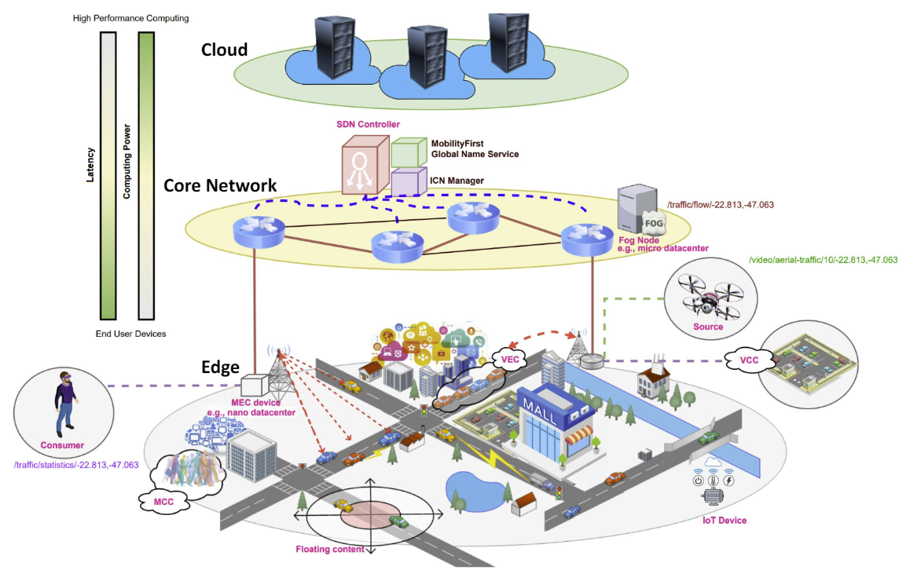

# Proposta

## 1 Problema

Arquiteturas Cloud Edge Continuum representam uma abordagem promissora para melhorar o QoS das aplicações e otimizar a utilização dos recursos.  No entanto, é complexo desenvolver estratégias para alocação de aplicações modulares nesses ambientes. Essa estratégia deve considerar as restrições da infraestrutura, atender as demandas dos usuários e otimizar a utilização dos recursos para reduzir os custos. Desse modo, a estratégia deve considerar:
- Os desafios de provisionamento;
- As políticas de proteção de dados;
- Requisitos de privacidade;
- Escalabilidade;
- Compartilhamento de Recursos;
- Garantia da disponibilidade;

## 2 Objetivo

Desenvolver uma estratégia para alocação de múltiplas aplicações modulares heterogêneas de forma escalável respondendo a demanda, atendendo os requisitos dos usuários, requisitos de privacidade, políticas de proteção de dados, restrições da infraestrutura e otimizando a utilização dos recursos.

Aplicações heterogêneas:
- Sensíveis a latência;
- Tolerantes a falha;
- e etc;

Escalabilidade:
- O uso da infra vai crescer ou reduzir diante da demanda que pode ser simulada;
- Podemos usar datasets com essa demanda e aplicar até algoritmos de previsão para acelerar a resposta da escalabilidade e otimizar a economia dos recursos.

Multitenancy

## 3 Possíveis Trabalhos Relacionados

- 1 - Component-based Scheduling for Fog Computing
- 2 - Latency-Aware Multi-Objective Fog Scheduling: Addressing Real-Time Constraints in Distributed Environments
- 3 - Deadline and energy-aware application module placement in fog-cloud systems
- 4 - Cost-aware service placement and scheduling in the edge-cloud continuum
- 5 - Cmfogv: Proactive content migration for multi-level fog computing 
- 6 - Hierarchical scheduling mechanisms in multi-level fog computing
- 7 - Enhancing modular application placement in a hierarchical fog computing: A latency and communication cost-sensitive approach
- 8 - Latency-aware privacy-preserving service migration in federated edges
- 9 - Thea - a qos, privacy, and power-aware algorithm for placing applications on federated edges
- 10 - A hybrid meta-heuristic algorithm for multi-objective IoT service placement in fog computing environments
- 11 - MicroFog: A framework for scalable placement of microservices-based IoT applications in federated fog environments

## 4 Desafios relacionados ao simulador

- **Criar Dinamicamente o JSON da Infraestrutura**: Definir o JSON na mão é trabalhoso. Além disso, limita muito o tamanho e características dos cenários que podemos trabalhar. Sendo assim, seria importante ter um programa em Python que diante de uma entrada (número de servidores, redes e etc) cria o JSON para colocarmos como entrada na Simulação;
	- Tarefa compartilhada com o Grupo.
- **Estender as capacidades do simulador**: Ver a possibilidade de estendermos as classes do Simulador para criar cenários mais complexos. Por exemplo, criar uma nova classe baseada no EdgeServer ou ComponentManager com novos parâmetros para facilitar a criação de mais restrições e justificar a utilização de algoritmos de IA.
	- Em andamento.
- **Modificar a infraestrutura dinamicamente**: Ver se é possível modificar a infraestrutura em tempo de execução, ou seja, com a simulação rodando.
	- Falha na primeira validação;
- **Migração de serviços e desalocação**: Encontrar formas eficiente de realizar a migração ou remoção de um determinado serviço do servidor.
	- Alocação OK;

## 5 

Construção de um pull de recursos que ficam em esperando...
Trade off -> Buffer