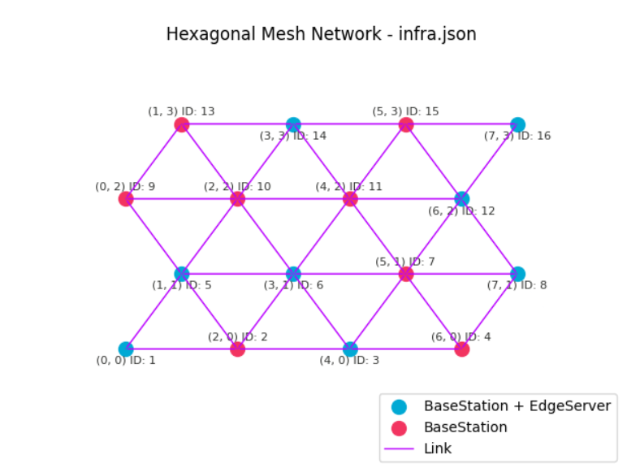

# Workload Planning

# Fatores e Níveis

| Fatores   | Níveis     |
| --------- | ---------- |
| Algoritmo | PEAP/Thea  |
| Workload  | Baixo/Alto |
| Clod      | On/Off     |

## Cenário 01 - Edge




 EdgeServers:

| Id  | cpu | memory | disk  | coord | provedor |
| --- | --- | ------ | ----- | ----- | -------- |
| 1   | 2   | 2048   | 20480 | 7,3   | 1        |
| 2   | 2   | 2048   | 20480 | 7,1   | 1        |
| 3   | 4   | 2048   | 30720 | 1,1   | 2        |
| 4   | 4   | 2048   | 30720 | 3,1   | 2        |
| 5   | 4   | 4096   | 30720 | 6,2   | 3        |
| 6   | 4   | 4096   | 30720 | 3,3   | 3        |
| 7   | 8   | 8192   | 40960 | 4,0   | 4        |
| 8   | 8   | 8192   | 40960 | 0,0   | 4        |

Total dos recursos: CPU 32,M32Gb

Services:

| Id  | cpu_demand | memory_demand | app_id |
| --- | ---------- | ------------- | ------ |
| 1   | 2          | 1024          | 1      |
| 2   | 1          | 1024          | 2      |
| 3   | 2          | 2048          | 3      |
| 4   | 4          | 4096          | 4      |
| 5   | 2          | 2048          | 5      |
| 6   | 1          | 4096          | 6      |
| 7   | 1          | 1024          | 1      |
| 8   | 1          | 1024          | 2      |
| 9   | 2          | 1024          | 3      |
| 10  | 2          | 1024          | 4      |
| 11  | 1          | 1024          | 5      |
| 12  | 1          | 1024          | 6      |
Usuários:

| Id  | coord | app_id | base_id |
| --- | ----- | ------ | ------- |
| 1   | 2,0   | 1      | 2       |
| 2   | 1,3   | 2      | 13      |
| 3   | 5,1   | 3      | 7       |
| 4   | 6,0   | 4      | 4       |
| 5   | 5,3   | 5      | 15      |
| 6   | 7,3   | 6      | 16      |

Base Station:

A base Station tem a mesma coord do EdgeServer

| Id  | coord | id_switch | id_edge_server |
| --- | ----- | --------- | -------------- |
| 1   | 0,0   | 1         | 8              |
| 2   | 2,0   | 2         | -              |
| 3   | 4,0   | 3         | 7              |
| 4   | 6,0   | 4         | -              |
| 5   | 1,1   | 5         | 3              |
| 6   | 3,1   | 6         | 4              |
| 7   | 5,1   | 7         | -              |
| 8   | 7,1   | 8         | 2              |
| 9   | 0,2   | 9         | -              |
| 10  | 2,2   | 10        | -              |
| 11  | 4,2   | 11        | -              |
| 12  | 6,2   | 12        | 5              |
| 13  | 1,3   | 13        | -              |
| 14  | 3,3   | 14        | 6              |
| 15  | 5,3   | 15        | -              |
| 16  | 7,3   | 16        | 1              |

#### Network

Link:
- delay: 5
- bandwidth": 12.5
Latency geration values paramethers: 

```python
mu, sigma = 20, 5
```


Carga baixa e alta de serviços paralelos:
- 10
- 20

Baixo -> 50% carga
Alto -> 100%

Dobrar os serviços

Violações de Privacidade -> Inverter -> menor melhor 

Colocar sempre a baixa carga primeiro, o leitor quer ver a evolução


## Cenário 02 - EdgeCloudContinuum


## Importante

Considerando que todos os microserviços tem o mesmo peso... Podemos considerar pesos diferentes, quantidade de dados, workflow....

Analisar o impacto da migração, as vezes não compensa migrar...

Service priority -> Serviços Back end e Banco de dados perto;


